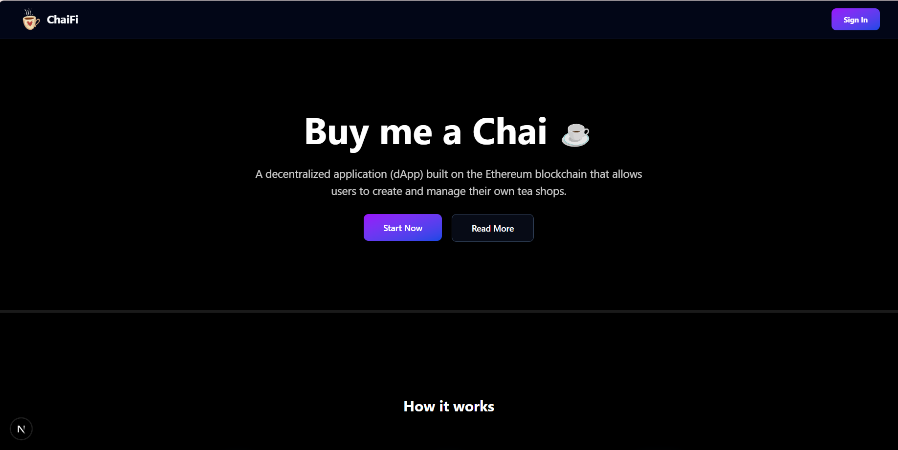
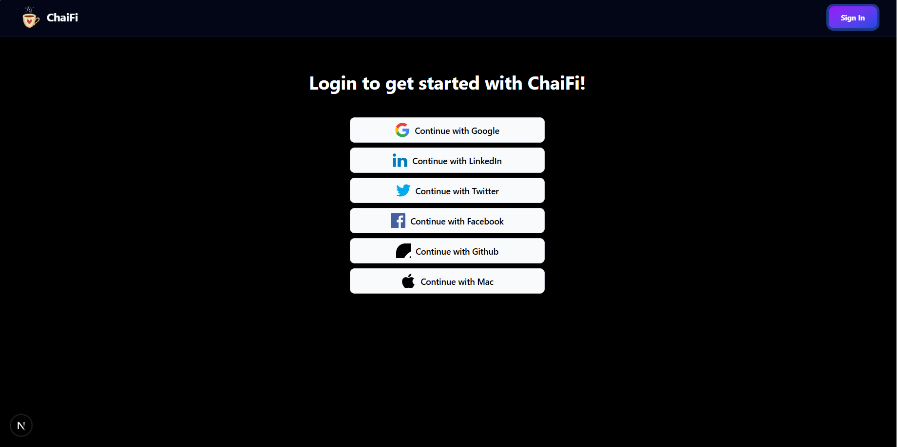
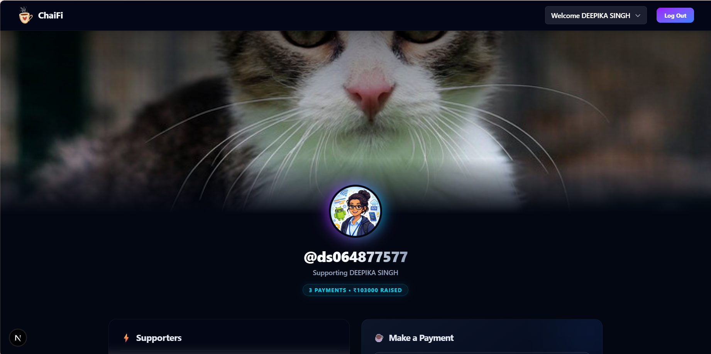
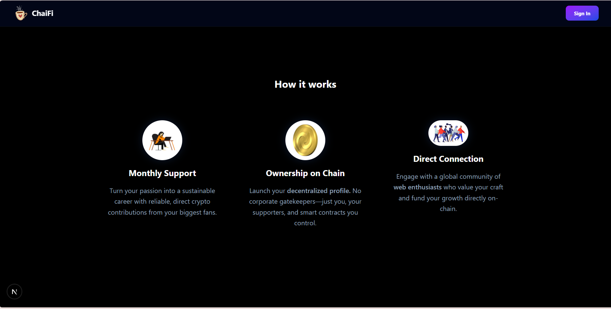
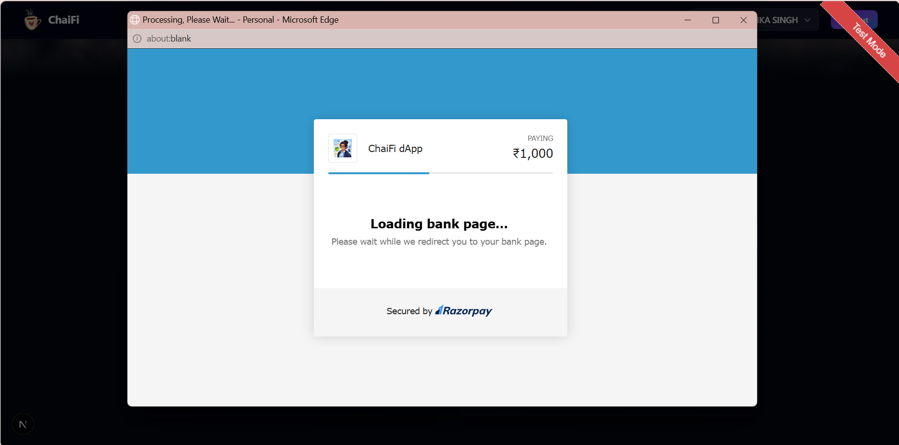
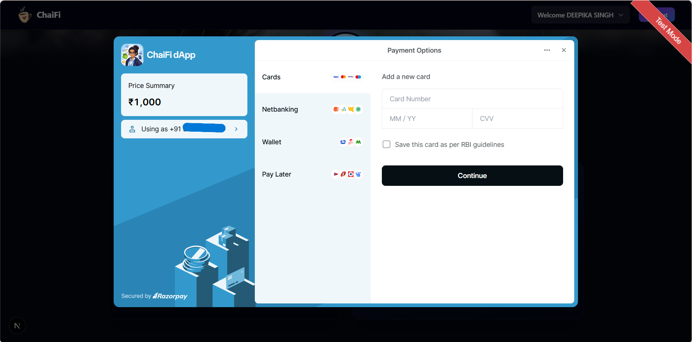
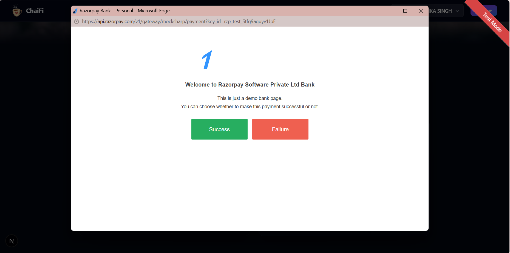

☕ ChaiFi - A Decentralized Patreon Clone
ChaiFi is a full-stack, decentralized crowdfunding platform built on Next.js and MongoDB. Inspired by Patreon, it allows creators to showcase their work and enables fans to support them seamlessly via digital payments ("Buy Me a Chai"). The application leverages NextAuth.js for secure social authentication and implements efficient database caching to manage user sessions dynamically.

🚀 Features
   Social Authentication: Secure login using GitHub OAuth via NextAuth.js.

   Dynamic Session Handling: Automatically injects custom database fields (like custom usernames) right into the client-side session context.

   MERN Backend Integration: Uses Mongoose to interface with a MongoDB instance for persisting user profiles and payment records.

   Next.js App Router Architecture: Utilizes the latest Next.js paradigms, optimized for fast performance using the Turbopack rust-based build engine.

   Responsive Client Components: Modular layout containing reusable navigation and server-side state wrappers (SessionWrapper).

🛠️ Tech Stack
   Framework: Next.js (App Router)

   Authentication: NextAuth.js (v4)

   Database: MongoDB via Mongoose Object Modeling

   Styling: Tailwind CSS

   Environment: Node.js

📂 Project Structure Overview

ChaiFi/
├── app/
│   ├── api/
│   │   └── auth/
│   │       └── [...nextauth]/
│   │           └── route.js      # NextAuth configuration & lifecycle hooks
│   ├── layout.js                 # Global layout with SessionWrapper
│   └── page.js                   # Landing/Home Component
├── components/
│   ├── Navbar.js                 # Client-side navigation & OAuth controls
│   └── SessionWrapper.js         # Client-side NextAuth Session Provider
├── models/
│   ├── User.js                   # MongoDB Mongoose Schema for Users
│   └── Payment.js                # MongoDB Mongoose Schema for Transactions
├── public/                       # Static assets (images, icons)
├── jsconfig.json                 # Absolute import configurations (@/*)
└── package.json                  # Dependencies & scripts

⚙️ Installation & Setup
1. Clone the Repository
git clone https://github.com/your-username/ChaiFi.git
cd ChaiFi

2. Install Dependencies
Ensure you resolve peer dependencies correctly if utilizing cutting-edge versions of the Next.js runtime:
npm install

3. Environment Variables Configuration
Create a .env.local file in the root directory and populate it with your respective API keys and secrets:

# NextAuth Configuration
NEXTAUTH_URL=http://localhost:3000
NEXTAUTH_SECRET=your_super_secret_nextauth_string

# GitHub OAuth Credentials
GITHUB_ID=your_github_client_id
GITHUB_SECRET=your_github_client_secret

# Database Configuration
MONGODB_URI=mongodb://localhost:27017/chai

4. Running the Development Server
Launch the application using Next.js’s high-performance Turbopack engine:
npm run dev
Open http://localhost:3000 in your browser to interact with the application.

🛡️ Authentication Lifecycle Flow
   Sign In: Users initiate login on the client side via the Navbar component (signIn("github")).

   Verification: NextAuth redirects the handshake to GitHub OAuth. Upon successful validation, it triggers the internal signIn() callback inside app/api/auth/[...nextauth]/route.js.

   Synchronization: The application checks the MongoDB database. If the user profile is unrecognized, a structured document is automatically provisioned using the User model.

   Session Hydration: The custom session() callback runs, querying MongoDB to fetch properties like the unique username and binding it directly onto session.user so it's accessible globally across the front end.

## 📸 Project Screenshots

### 🔑 Authentication & Landing
<table width="100%">
  <tr>
    <td width="50%" align="center"><b>Landing Page</b></td>
    <td width="50%" align="center"><b>Login Screen</b></td>
  </tr>
  <tr>
    <td></td>
    <td></td>
  </tr>
</table>

### 📊 User Dashboard & Settings
<table width="100%">
  <tr>
    <td width="50%" align="center"><b>Dashboard View</b></td>
    <td width="50%" align="center"><b>Profile Settings</b></td>
  </tr>
  <tr>
    <td></td>
    <td></td>
  </tr>
</table>

### 💳 Razorpay Payment Workflow
<table width="100%">
  <tr>
    <td width="33%" align="center"><b>Payment Options</b></td>
    <td width="34%" align="center"><b>Bank Gateway</b></td>
    <td width="33%" align="center"><b>Confirmation Screen</b></td>
  </tr>
  <tr>
    <td></td>
    <td></td>
    <td></td>
  </tr>
  <tr>
    <td align="center"><b>Processing Payment</b></td>
    <td align="center"><b>Success Receipt</b></td>
    <td align="center"><b>Thank You Screen</b></td>
  </tr>
  <tr>
    <td></td>
    <td></td>
    <td></td>
  </tr>
</table>

